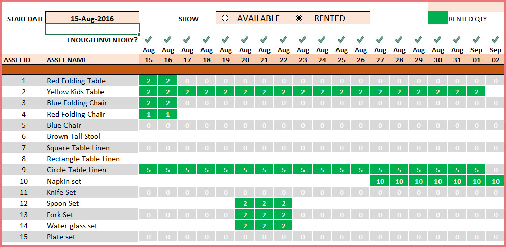

# crowdproj-resources-bookings
The Resources Bookings Service is a service designed to manage and control both available and booked timeslots, facilitating efficient resource allocation and tracking within various software applications such as ERP, CRM, planners, calendars, and more.

## Frontend User Interface (UI) (example)

## Documentation
1. Marketing
    1. [Target audience](./docs/01-marketing/01-target audience.md)
    2. [User portraits](./docs/01-marketing/02-user portraits.md)
    3. [MVP](./docs/01-marketing/03-mvp.md)
    4. [Api and Entities](./docs/02-architecture/01-Api%20and%20Entities.md)
    5. [Architecture scheme](./docs/02-architecture/02-architecture%20scheme.md)